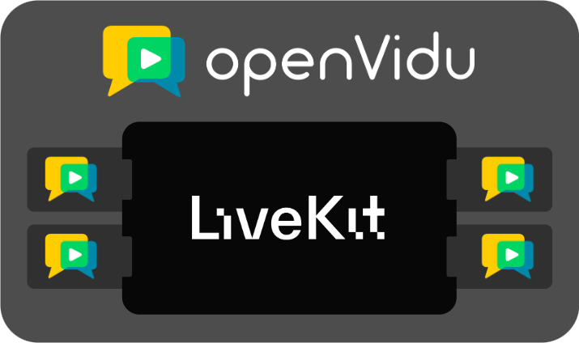

[OpenVidu](https://openvidu.io){target=\_blank} is a powerful platform to develop WebRTC real-time applications. With it you can add real-time audio and video capabilities to your application: build any kind of videoconference experience, serve ultra-low latency livestreams to thousands of users, manage real-time videos from your drones or camera feeds and record them... The possibilities are truly endless!

It is based on [LiveKit](https://livekit.io/){target=\_blank} and [mediasoup](https://mediasoup.org/){target=\_blank}, bringing the best of both worlds to provide a performant, fault-tolerant, scalable and observable solution.

<svg class="home-icon livekit-icon" xmlns="http://www.w3.org/2000/svg" viewBox="0 0 123 28" role="img">
<title id="title" lang="en">LiveKit Logo</title>
<path d="M4.6991 0H0V27.5637H17.0471V23.538H4.6991V0Z" fill="white"></path>
<path d="M24.8038 12.5483H20.2506V27.5626H24.8038V12.5483Z" fill="white"></path>
<path d="M38.2078 27.0186L32.4163 8.01416H27.863L33.9463 27.563H42.4693L48.5525 8.01416H43.9625L38.2078 27.0186Z" fill="white"></path>
<path d="M59.8483 7.58105C53.9466 7.58105 50.1951 11.7886 50.1951 17.7724C50.1951 23.7206 53.8374 28.0002 59.8483 28.0002C64.4372 28.0002 67.7521 25.9691 68.9904 21.7981H64.3604C63.6689 23.684 62.3928 24.8104 59.8796 24.8104C57.1114 24.8104 55.1816 22.8879 54.8175 19.1171H69.3145C69.3838 18.6364 69.4199 18.1515 69.4226 17.6659C69.4237 11.5702 65.6354 7.58105 59.8483 7.58105ZM54.8531 15.9585C55.3275 12.4416 57.1848 10.773 59.8483 10.773C62.6522 10.773 64.5463 12.8397 64.7656 15.9585H54.8531Z" fill="white"></path>
<path d="M96.0482 0H90.1476L78.7105 12.6216V0H74.0114V27.5637H78.7105V13.6372L91.3134 27.5637H97.3232L84.1378 13.0562L96.0482 0Z" fill="white"></path>
<path d="M103.914 8.01416H99.3606V23.0284H103.914V8.01416Z" fill="white"></path>
<path d="M20.2511 8.01416H15.6979V12.5477H20.2511V8.01416Z" fill="white"></path>
<path d="M108.468 23.0298H103.915V27.5633H108.468V23.0298Z" fill="white"></path>
<path d="M122.073 23.0298H117.52V27.5633H122.073V23.0298Z" fill="white"></path>
<path d="M122.073 12.5484V8.0149H117.52V0H112.966V8.0149H108.413V12.5484H112.966V23.0302H117.52V12.5484H122.073Z" fill="white"></path>
</svg>
<h4 class="livekit-title">and</h4>

<h4 class="livekit-title">based</h4>

 OpenVidu is built upon <strong>
<a href="https://livekit.io/" target="_blank">LiveKit</a></strong> and <strong><a href="https://mediasoup.org/" target="_blank">mediasoup</a></strong>
</strong>, the best open source, cutting edge, end-to-end WebRTC stacks. OpenVidu takes the best of LiveKit and the best of mediasoup and mix them together in the ultimate real-time solution.

<svg xmlns="http://www.w3.org/2000/svg" viewBox="0 0 24 24" class="home-icon">
<title>server</title>
<path fill="white"
d="M4,1H20A1,1 0 0,1 21,2V6A1,1 0 0,1 20,7H4A1,1 0 0,1 3,6V2A1,1 0 0,1 4,1M4,9H20A1,1 0 0,1 21,10V14A1,1 0 0,1 20,15H4A1,1 0 0,1 3,14V10A1,1 0 0,1 4,9M4,17H20A1,1 0 0,1 21,18V22A1,1 0 0,1 20,23H4A1,1 0 0,1 3,22V18A1,1 0 0,1 4,17M9,5H10V3H9V5M9,13H10V11H9V13M9,21H10V19H9V21M5,3V5H7V3H5M5,11V13H7V11H5M5,19V21H7V19H5Z" />
</svg>
<h4>On-Premises</h4>

OpenVidu is provided as a software that you install <strong><a href="/docs/on-premises/">on your own
servers</a></strong>. You can easily deploy and manage a fully fledged live-video solution
in your own infrastructure, including the most popular cloud providers.

<svg class="home-icon" xmlns="http://www.w3.org/2000/svg" viewBox="0 0 24 24">
<title>lightning-bolt</title>
<path fill="white" d="M11 15H6L13 1V9H18L11 23V15Z" />
</svg>
<h4>Performant</h4>

OpenVidu is built to be incredibly powerful. It uses LiveKit at its core, but it goes much further
providing up to <strong><a href="/docs/performance">2x performance</a></strong> of LiveKit. You can
host double the users in your video rooms just by using OpenVidu.

<svg class="home-icon" xmlns="http://www.w3.org/2000/svg" viewBox="0 0 24 24">
<title>chart-timeline-variant-shimmer</title>
<path fill="white"
d="M21 8C19.5 8 18.7 9.4 19.1 10.5L15.5 14.1C15.2 14 14.8 14 14.5 14.1L11.9 11.5C12.3 10.4 11.5 9 10 9C8.6 9 7.7 10.4 8.1 11.5L3.5 16C2.4 15.7 1 16.5 1 18C1 19.1 1.9 20 3 20C4.4 20 5.3 18.6 4.9 17.5L9.4 12.9C9.7 13 10.1 13 10.4 12.9L13 15.5C12.7 16.5 13.5 18 15 18C16.5 18 17.3 16.6 16.9 15.5L20.5 11.9C21.6 12.2 23 11.4 23 10C23 8.9 22.1 8 21 8M15 9L15.9 6.9L18 6L15.9 5.1L15 3L14.1 5.1L12 6L14.1 6.9L15 9M3.5 11L4 9L6 8.5L4 8L3.5 6L3 8L1 8.5L3 9L3.5 11Z" />
</svg>
<h4>Scalable</h4>

OpenVidu has been designed from the outset with <strong><a
href="/docs/scalability">scalability</a></strong>
in mind. Add nodes to increase the capacity of
your cluster when necessary and remove them when no longer needed to optimize your resources.

<svg class="home-icon" xmlns="http://www.w3.org/2000/svg" viewBox="0 0 24 24">
<title>shield-refresh</title>
<path fill="white"
d="M18 12C19 12 20 12.2 20.9 12.7C21 12.1 21 11.6 21 11V5L12 1L3 5V11C3 16.5 6.8 21.7 12 23C12.4 22.9 12.7 22.8 13 22.7C12 21.5 11.5 20 11.5 18.5C11.5 14.9 14.4 12 18 12M18 14.5C19.1 14.5 20.1 14.9 20.8 15.7L22 14.5V18.5H18L19.8 16.7C19.3 16.3 18.7 16 18 16C16.6 16 15.5 17.1 15.5 18.5S16.6 21 18 21C18.8 21 19.5 20.6 20 20H21.7C21.1 21.5 19.7 22.5 18 22.5C15.8 22.5 14 20.7 14 18.5S15.8 14.5 18 14.5Z" />
</svg>
<h4>Fault Tolerant</h4>

OpenVidu offers <strong><a href="/docs/fault-tolerance">fault tolerance</a></strong> in all its
components. Deploy a reliable cluster knowing that if one of your node goes down, others will be
able to continue working with no downtime.

<svg class="home-icon" xmlns="http://www.w3.org/2000/svg" viewBox="0 0 24 24">
<title>microscope</title>
<path fill="white"
d="M9.46,6.28L11.05,9C8.47,9.26 6.5,11.41 6.5,14A5,5 0 0,0 11.5,19C13.55,19 15.31,17.77 16.08,16H13.5V14H21.5V16H19.25C18.84,17.57 17.97,18.96 16.79,20H19.5V22H3.5V20H6.21C4.55,18.53 3.5,16.39 3.5,14C3.5,10.37 5.96,7.2 9.46,6.28M12.74,2.07L13.5,3.37L14.36,2.87L17.86,8.93L14.39,10.93L10.89,4.87L11.76,4.37L11,3.07L12.74,2.07Z" />
</svg>
<h4>Observable</h4>

OpenVidu provides different tools and APIs to <strong><a
href="/docs/observability">monitor</a></strong>
the status, health, performance and history of
your deployment. It automatically collects logs and metrics and offers a dashboard to visualize
them.

## OpenVidu editions

OpenVidu is available in two editions:

- **OpenVidu** <a href="/pricing#openvidu-community">COMMUNITY</a>: free to use. It is a single-server deployment and provides a custom LiveKit distribution with Egress, Ingress, S3 storage and monitoring. Ideal for development and testing, but also for small-scale production deployments. You can host hundreds of simultaneous participants in your rooms by running OpenVidu Community in a sufficiently powerful server!
- **OpenVidu** <a href="/pricing#openvidu-pro">PRO</a>: OpenVidu commercial edition. It is a multi-server deployment with all the features of OpenVidu Community plus 2x performance, scalability, fault tolerance and improved monitoring and observability. Ideal for large-scale production deployments with heavy traffic that require the highest standards. You can start with OpenVidu Community and upgrade to OpenVidu Pro when needed.

Visit [openvidu.io](https://openvidu.io) to learn more about what OpenVidu has to offer.

<!-- - :material-server: **On-Premises**: take full control of your resources and data. OpenVidu is designed to be easily deployed in your own infrastructure, keeping all of your application's data completely secure without ever leaving your domain. The management, maintenance and updating of your cluster becomes an easy task with OpenVidu. We also provide ready-to-use native deployments in the most popular cloud providers.
- :material-lightning-bolt: **Performant**: OpenVidu is built to be incredibly powerful, providing up to 2x performance of LiveKit. You can host double the users in your video rooms just by using OpenVidu.
- :material-shield-refresh: **Fault tolerance**: OpenVidu deployments are natively fault tolerant in all of their components. In real-time applications, downtime events are extremely disruptive, so with OpenVidu node failures are handled appropriately to provide a seamless experience with no downtime.
- :material-chart-timeline-variant-shimmer: **Scalable**: add nodes to increase the capacity of your cluster when necessary and remove them when no longer needed to optimize your resources and squeeze the most out of them.
- :material-microscope: **Observable**: OpenVidu provides different tools and APIs to monitor the status, health, performance and history of your deployment. It automatically collects logs and metrics and offers a dashboard to visualize them.

<figure markdown>
  { .mkdocs-img }
  <figcaption>OpenVidu is a 100%-compatible fork of LiveKit and extends it with custom addons and APIs. These extensions provide improved performance, new features and facilitate the deployment and management of your cluster.</figcaption>
</figure> -->

 
